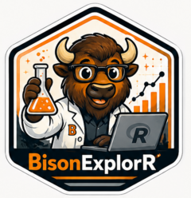

# BisonExplorR
# BisonExplorR 

<!-- badges: start -->
<!-- badges: end -->

Interactive R programming tutorials for BIOL 203/204 Integrated Concepts 
in Biology at Bucknell University.

## Installation

You can install the development version of BisonExplorR from [GitHub](https://github.com/) with:

``` r
# install.packages("pak")
pak::pak("aso003-bucknell/BisonExplorR")
```

## Tutorials

- **Module 1:** Introduction to R and data import
- **Module 2:** Data wrangling and visualization  
- **Module 3:** Statistical analysis

## About

BisonExplorR is developed as part of a Bucknell IDEA Grant to support 
interactive, flipped-classroom R instruction in introductory biology.
