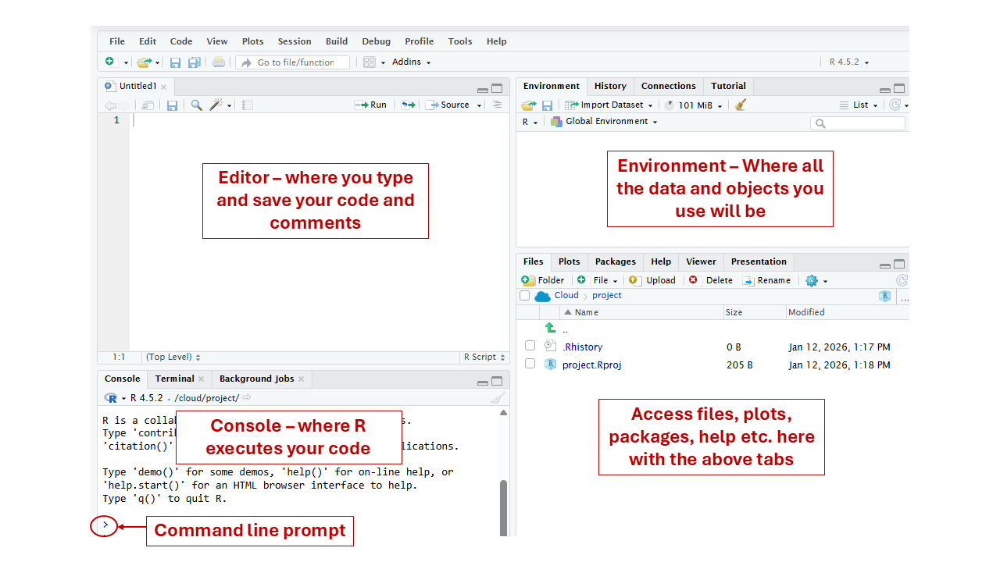

```{r setup, include=FALSE}
library(learnr)
library(shiny)
library(gradethis)
library(httr)

gradethis_setup()

tutorial_options(
  exercise.checker = gradethis::grade_learnr,
  exercise.completion = TRUE
)

`%||%` <- function(a, b) if (!is.null(a) && length(a) > 0) a else b

# Resolve the student ID no matter which session scope a handler receives.
# VERIFIED 2026-07-25 (learnr 0.11.6): question() blocks are Shiny MODULES, so
# a question_submission handler gets a NAMESPACED session whose input$sid is
# EMPTY. The ID lives on the root session. This fails silently -- rows land in
# the sheet looking well-formed but unattributable, grade_module() drops them,
# and the student loses that score with no warning anywhere. Do not "simplify"
# this back to session$input$sid.
bx_get_sid <- function(session) {
  usable <- function(x) !is.null(x) && length(x) > 0 && nzchar(as.character(x)[1])
  sid <- tryCatch(session$rootScope()$input$sid, error = function(e) NULL)
  if (usable(sid)) return(sid)
  sid <- tryCatch(session$userData$bx_sid, error = function(e) NULL)
  if (usable(sid)) return(sid)
  sid <- tryCatch(session$input$sid, error = function(e) NULL)
  if (usable(sid)) return(sid)
  NULL   # log_attempt()'s %||% turns this into "unknown"
}

# Is this the GRADED deployment or a practice copy?
# Set BISONEXPLORR_GRADED=true in the deployed app's .Renviron (or set the
# option in its startup). Practice copies launched with run_tutorial() never
# see it, so they default to FALSE.
#
# WHY THE PRACTICE BRANCH SHOWS A VISIBLE BANNER RATHER THAN NOTHING: if this
# flag is ever missing on a deployed graded app, the ID box disappears and
# nothing logs -- every student silently scores zero. A banner makes a
# misconfigured deploy announce itself on the first screen instead of three
# weeks later in the response sheet.
bx_is_graded <- function() {
  isTRUE(getOption(
    "BisonExplorR.graded",
    identical(tolower(Sys.getenv("BISONEXPLORR_GRADED")), "true")
  ))
}

log_attempt <- function(student_id, exercise_id, correct) {
  # Practice copies do not log. Without this, practice attempts POST with
  # student_id = "unknown" and fill the response sheet with orphan rows
  # that look like a bug in grade_module().
  if (!bx_is_graded()) return(invisible(NULL))

  tryCatch({
    httr::POST(
      url = "https://docs.google.com/forms/d/e/1FAIpQLSfmm3cUcoaWWYBb0zk7rbowSpgUL13nQc-Dxn7K8zQ30GdykA/formResponse",
      body = list(
        "entry.1413675438" = as.character(Sys.time()),
        "entry.1257984687" = as.character(student_id %||% "unknown"),
        "entry.1315894547" = "module1",
        "entry.1172625272" = as.character(exercise_id %||% "unknown"),
        "entry.1835356043" = as.character(correct %||% "NA")
      ),
      encode = "form"
    )
  }, error = function(e) message("Logging failed: ", e$message))
}

# Package dataset — always available
soil <- read.csv(system.file("extdata", "soil_data.csv", package = "BisonExplorR"))
```

```{r event-setup, context="server-start"}
event_register_handler("exercise_result", function(session, event, data) {
  log_attempt(
    student_id  = bx_get_sid(session),
    exercise_id = data$label,
    correct     = data$feedback$correct
  )
})
```

## Welcome to R

R is a programming language built for data analysis. In this first module, you will learn how to recognize the main parts of RStudio, write simple code, create objects, and inspect a dataset that has already been loaded for you.

By the end of this module, you should be able to:

- Identify the four main panes in RStudio
- Explain the difference between the Source pane and Console
- Assign a value to an object using `<-`
- Identify numeric, character, and logical data types
- Use `head()`, `str()`, and `summary()` to explore a dataframe
- Access a single column using `$`

::: {style="background-color: #f0f4ff; border-left: 4px solid #3355aa; padding: 12px 16px; margin-bottom: 16px;"}
**Before you begin:** Enter your Bucknell username below. Submissions will not be recorded correctly without it. Use the same format as your Bucknell email, without the @bucknell.edu (for example, abc012). You only need to enter it once per session.
:::

```{r student-id, echo=FALSE}
uiOutput("sid_ui")
```

```{r sid-server, context="server"}
# The ID box exists ONLY in the graded deployment. See bx_is_graded() in setup.
output$sid_ui <- renderUI({
  if (!bx_is_graded()) {
    return(shiny::div(
      style = paste("padding:12px 14px; margin:6px 0;",
                    "border-left:4px solid #C05621; background:#FDF6EC;"),
      shiny::strong("Practice mode."),
      " Nothing here is recorded and this copy does not count for credit.",
      " To do this module for credit, run ",
      shiny::tags$code('launch_graded_tutorial("module1")'),
      " instead."
    ))
  }
  shiny::tagList(
    shiny::div(
      style = paste("padding:12px 14px; margin:6px 0;",
                    "border-left:4px solid #1F3864; background:#F2F4F7;"),
      shiny::strong("Graded copy."),
      " Your work on this module is recorded, so enter your student ID before",
      " you begin. Use the same ID every time \u2014 a different ID reads as a",
      " different student and your work will not be combined."
    ),
    shiny::textInput("sid",
      "Student ID (the same one you used in Module 1):", value = ""),
    shiny::div(id = "sid_warn",
      style = "color:#C05621; font-weight:600; margin:-6px 0 8px 0;",
      "Enter your ID to continue."),
    # Client-side gate on the section's Continue button. This prevents the
    # ACCIDENTAL case (a student who forgets), not a determined one -- anyone
    # with devtools can re-enable the button. The real protection against
    # unattributed rows is that grade_module() drops blank IDs.
    shiny::tags$script(shiny::HTML("
      (function () {
        function apply() {
          var sid = document.getElementById('sid');
          if (!sid) return;
          var sec = sid.closest('.section');
          if (!sec) return;
          var btns = sec.querySelectorAll('.topicActions button, .continueButton');
          var ok = sid.value.trim().length > 0;
          btns.forEach(function (b) {
            b.disabled = !ok;
            b.style.opacity = ok ? '' : '0.45';
            b.style.cursor  = ok ? '' : 'not-allowed';
          });
          var w = document.getElementById('sid_warn');
          if (w) w.style.display = ok ? 'none' : 'block';
        }
        document.addEventListener('input', function (e) {
          if (e.target && e.target.id === 'sid') apply();
        });
        // learnr renders sections progressively, so the Continue button may not
        // exist yet when this script first runs.
        new MutationObserver(apply)
          .observe(document.body, { childList: true, subtree: true });
        apply();
      })();
    "))
  )
})

# Cache the ID on userData as a second, independent path to it. bx_get_sid()
# checks rootScope() first and falls back to this.
shiny::observeEvent(input$sid, {
  if (!is.null(input$sid) && nzchar(input$sid)) {
    session$userData$bx_sid <- input$sid
  }
}, ignoreInit = TRUE)
```

```{r confirm-sid, echo=FALSE}
renderText({
  sid <- input$sid
  if (nchar(trimws(sid)) > 0) {
    paste("Logging as:", trimws(sid))
  } else {
    "No username entered yet."
  }
})
```

------------------------------------------------------------------------

## The RStudio Interface

When you open RStudio, you will see four panes:

**Source** — where you write and save R scripts

**Console** — where R runs your code and prints output

**Environment** — where you see objects you have created

**Files / Plots / Packages / Help / Viewer** — where you browse files, view plots, manage packages, and access help

{width="100%"}

You will type most of your code in the **Source** pane and run it line by line. In this tutorial, the code boxes work in a similar way: write your code, click **Run Code** to test it, and click **Submit Answer** to check it.

### Check your understanding

```{r panes-quiz-check, echo=FALSE}
quiz(
  caption = "",
  question("Where does R display a plot after you run plotting code?",
    answer("Source pane"),
    answer("Console pane"),
    answer("Plots pane", correct = TRUE, message = "Correct — plots appear in the Plots pane."),
    answer("Environment pane"),
    allow_retry = TRUE
  )
)
```

------------------------------------------------------------------------

## Objects and Assignment

In R, you store values using the assignment operator `<-`. The result is called an **object**.

```{r assign-demo, exercise=FALSE, echo=TRUE}
site_name <- "Forest Plot A"
site_name
```

The object `site_name` now stores the value `"Forest Plot A"`. You can also see it appear in the Environment pane.

### Your turn

Create an object called `num_samples` and assign it the value `15`.

```{r assign-exercise, exercise=TRUE}
# Create your object below

```

```{r assign-exercise-check}
grade_this({
  pass_if(
    user_object_exists("num_samples") &&
      identical(user_object_get("num_samples"), 15),
    "Correct — `num_samples` is now 15."
  )

  fail_if(
    !user_object_exists("num_samples"),
    "Try again. Create an object called `num_samples`."
  )

  fail_if(
    user_object_exists("num_samples") &&
      !identical(user_object_get("num_samples"), 15),
    "Try again. `num_samples` exists, but it should be assigned the value 15."
  )

  fail("Use `<-` to assign the value 15 to an object called `num_samples`.")
})
```

------------------------------------------------------------------------

## Data Types in R

R recognizes several types of data. Three common types are:

| Type | Description | Example |
|------------------|--------------------------------|----------------------|
| `numeric` | Numbers, including measurements and counts | `12.4`, `5` |
| `character` | Text, usually written in quotes | `"forest"`, `"site_01"` |
| `logical` | TRUE or FALSE values | `TRUE`, `FALSE` |

You can check what type an object is using `class()`.

#### Try it: `class()`

Run the code below to see the class of each example.

```{r class-demo, exercise=TRUE}
class(3.14)
class("hello")
class(TRUE)
```

```{r class-demo-check}
grade_this({
  pass_if(
    identical(.result, "logical"),
    "Correct — you ran the `class()` examples."
  )

  fail("Run the code as written to see the class of each example.")
})
```

### Check your understanding

```{r types-quiz-check, echo=FALSE}
quiz(
  caption = "",
  question('A column containing values like "urban", "forest", and "agricultural" would be what data type in R?',
    answer("numeric"),
    answer("logical"),
    answer("character", correct = TRUE, message = 'Correct. Text values are stored as the character type.'),
    allow_retry = TRUE
  )
)
```

------------------------------------------------------------------------

## Working with a Dataframe

A **dataframe** is R's version of a spreadsheet. It has rows and columns.

In this tutorial, the soil dataset is already loaded for you as an object called `soil`.

### Confirm the data loaded

Run the line below. You should see `"data.frame"`, which means `soil` is stored as a dataframe.

```{r confirm-load, exercise=TRUE}
class(soil)
```

```{r confirm-load-check}
grade_this({
  pass_if(
    identical(.result, "data.frame"),
    "Good — you ran the check."
  )

  fail("Run `class(soil)` to check that the dataset is available.")
})
```

------------------------------------------------------------------------

## Exploring a Dataframe

Once you have a dataframe, the first thing to do is look at it. Three functions are especially useful.

#### `head()` - see the first six rows

```{r head-exercise, exercise=TRUE}
# Use head() on the soil dataset

```

```{r head-exercise-check}
grade_this({
  pass_if(
    identical(.result, head(soil)),
    "Correct — `head(soil)` shows the first six rows of the dataset."
  )

  fail("Try again. Use `head(soil)` to view the first six rows.")
})
```

#### `str()` - see the structure

`str()` shows the variable names, data types, and a preview of the values.

```{r str-exercise, exercise=TRUE}
# Use str() on the soil dataset

```

```{r str-exercise-check}
grade_this({
  pass_if(
    grepl("str\\s*\\(\\s*soil\\s*\\)", .user_code),
    "Correct — `str(soil)` shows the structure of the dataset."
  )

  fail("Try again. Use `str(soil)` to inspect the dataset structure.")
})
```

#### `summary()` - see summary information

```{r summary-exercise, exercise=TRUE}
# Use summary() on the soil dataset

```

```{r summary-exercise-check}
grade_this({
  pass_if(
    identical(.result, summary(soil)),
    "Correct — `summary(soil)` gives summary information for each variable."
  )

  fail("Try again. Use `summary(soil)` to summarize the dataset.")
})
```

------------------------------------------------------------------------

### Reading `str()` Output

`str()` is one of the most useful functions you will use. Let's practice reading its output.

#### Run `str(soil)`

Run `str(soil)` once more, then answer the questions that follow.

```{r str-review, exercise=TRUE}
str(soil)
```

```{r str-review-check}
grade_this({
  pass_if(
    grepl("str\\s*\\(\\s*soil\\s*\\)", .user_code),
    "Correct — now use the output to answer the questions that follow."
  )

  fail("Try again. Run `str(soil)`.")
})
```

### Data Structure Quiz

```{r str-quiz-1-check, echo=FALSE}
quiz(
  caption = "",
  question("Question 1: How many observations (rows) does the soil dataset have?",
    answer("5"),
    answer("6"),
    answer("15", correct = TRUE, message = "Correct! The top line indicates there are 15 observations."),
    answer("3"),
    allow_retry = TRUE
  ),
  question("Question 2: In your str(soil) output, what data type is the land_use variable?",
    answer("numeric"),
    answer("logical"),
    answer("character", correct = TRUE, message = "Correct! It is listed as a character (chr) variable."),
    allow_retry = TRUE
  ),
  question("Question 3: What data type is soil_temp_c?",
    answer("character"),
    answer("logical"),
    answer("numeric", correct = TRUE, message = "Correct! In str() output, numeric variables usually appear as 'num'."),
    allow_retry = TRUE
  )
)
```

------------------------------------------------------------------------

## Accessing Individual Variables

You can pull out a single column from a dataframe using the `$` operator.

### The `$` operator

Run the line below to pull out the `land_use` column.

```{r dollar-demo, exercise=TRUE}
soil$land_use
```

```{r dollar-demo-check}
grade_this({
  pass_if(
    identical(.result, soil$land_use),
    "Correct — `soil$land_use` pulls out the `land_use` column."
  )

  fail("Run `soil$land_use` to access the `land_use` column.")
})
```

### Your turn

Use `$` to access the `organic_matter_pct` column.

```{r dollar-exercise, exercise=TRUE}
# Access the organic_matter_pct column from the soil data

```

```{r dollar-exercise-check}
grade_this({
  pass_if(
    identical(.result, soil$organic_matter_pct),
    "Correct — you accessed the `organic_matter_pct` column using `$`."
  )

  fail_if(
    identical(.result, soil$land_use),
    "That's the `land_use` column — try `soil$organic_matter_pct` instead."
  )

  fail_if(
    identical(.result, soil$soil_temp_c),
    "That's the `soil_temp_c` column — try `soil$organic_matter_pct` instead."
  )

  fail("Use the `$` operator to access the column: `soil$organic_matter_pct`.")
})
```

------------------------------------------------------------------------

## Module 1 Complete

You have covered:

- ✅ Navigating the RStudio interface
- ✅ Understanding the Source pane, Console, Environment, and Files / Plots / Help pane
- ✅ Creating objects with `<-`
- ✅ Identifying basic data types
- ✅ Exploring a dataframe with `head()`, `str()`, and `summary()`
- ✅ Reading basic `str()` output
- ✅ Accessing columns with `$`

```{r finish-button, echo=FALSE}
actionButton("finish_btn", "Mark as Complete", 
             style = "background-color: #3355aa; color: white; padding: 8px 20px;")

renderText({
  if (input$finish_btn > 0) {
    "✅ Module 1 complete! You may close this tab."
  }
})
```

```{r finish-logging, context="server", echo=FALSE}
observeEvent(input$finish_btn, {
  log_attempt(
    student_id  = input$sid,
    exercise_id = "module_complete",
    correct     = TRUE
  )
})
```

**Module 2** will show you how to set up your own Posit Cloud project and import your lab data.

```{r, echo=FALSE}
# Hide previous button on final topic
```
