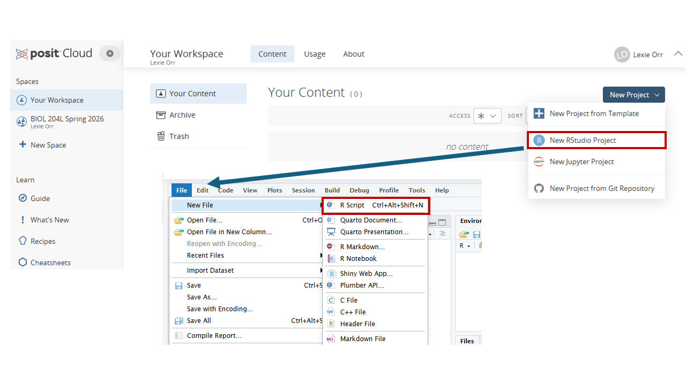

```{r setup, include=FALSE}
library(learnr)
library(shiny)
library(gradethis)
library(httr)
library(ggplot2)

gradethis_setup()

tutorial_options(
  exercise.checker = gradethis::grade_learnr,
  exercise.completion = TRUE
)

`%||%` <- function(a, b) if (!is.null(a) && length(a) > 0) a else b

# Resolve the student ID no matter which session scope a handler receives.
# VERIFIED 2026-07-25 (learnr 0.11.6): question() blocks are Shiny MODULES, so
# a question_submission handler gets a NAMESPACED session whose input$sid is
# EMPTY. The ID lives on the root session. This fails silently -- rows land in
# the sheet looking well-formed but unattributable, grade_module() drops them,
# and the student loses that score with no warning anywhere. Do not "simplify"
# this back to session$input$sid.
bx_get_sid <- function(session) {
  usable <- function(x) !is.null(x) && length(x) > 0 && nzchar(as.character(x)[1])
  sid <- tryCatch(session$rootScope()$input$sid, error = function(e) NULL)
  if (usable(sid)) return(sid)
  sid <- tryCatch(session$userData$bx_sid, error = function(e) NULL)
  if (usable(sid)) return(sid)
  sid <- tryCatch(session$input$sid, error = function(e) NULL)
  if (usable(sid)) return(sid)
  NULL   # log_attempt()'s %||% turns this into "unknown"
}

# Is this the GRADED deployment or a practice copy?
# Set BISONEXPLORR_GRADED=true in the deployed app's .Renviron (or set the
# option in its startup). Practice copies launched with run_tutorial() never
# see it, so they default to FALSE.
#
# WHY THE PRACTICE BRANCH SHOWS A VISIBLE BANNER RATHER THAN NOTHING: if this
# flag is ever missing on a deployed graded app, the ID box disappears and
# nothing logs -- every student silently scores zero. A banner makes a
# misconfigured deploy announce itself on the first screen instead of three
# weeks later in the response sheet.
bx_is_graded <- function() {
  isTRUE(getOption(
    "BisonExplorR.graded",
    identical(tolower(Sys.getenv("BISONEXPLORR_GRADED")), "true")
  ))
}

log_attempt <- function(student_id, exercise_id, correct) {
  # Practice copies do not log. Without this, practice attempts POST with
  # student_id = "unknown" and fill the response sheet with orphan rows
  # that look like a bug in grade_module().
  if (!bx_is_graded()) return(invisible(NULL))

  tryCatch({
    httr::POST(
      url = "https://docs.google.com/forms/d/e/1FAIpQLSfmm3cUcoaWWYBb0zk7rbowSpgUL13nQc-Dxn7K8zQ30GdykA/formResponse",
      body = list(
        "entry.1413675438" = as.character(Sys.time()),
        "entry.1257984687" = as.character(student_id %||% "unknown"),
        "entry.1315894547" = "module2",   # tutorial_id for this module
        "entry.1172625272" = as.character(exercise_id %||% "unknown"),
        "entry.1835356043" = as.character(correct %||% "NA")
      ),
      encode = "form"
    )
  }, error = function(e) message("Logging failed: ", e$message))
}

# Practice CSV path from the package
soil_file <- system.file("extdata", "soil_data.csv", package = "BisonExplorR")

# Pre-load the practice data so EVERY exercise can use lab_data.
# (learnr runs each exercise in its own environment; only objects created
#  here in the setup chunk are shared across all exercises.)
lab_data <- read.csv(soil_file)
```

```{r event-setup, context="server-start"}
event_register_handler("exercise_result", function(session, event, data) {
  log_attempt(
    student_id  = bx_get_sid(session),
    exercise_id = data$label,
    correct     = data$feedback$correct
  )
})
```

## Welcome to Module 2

```{r student-id, echo=FALSE}
uiOutput("sid_ui")
```

```{r sid-server, context="server"}
# The ID box exists ONLY in the graded deployment. See bx_is_graded() in setup.
output$sid_ui <- renderUI({
  if (!bx_is_graded()) {
    return(shiny::div(
      style = paste("padding:12px 14px; margin:6px 0;",
                    "border-left:4px solid #C05621; background:#FDF6EC;"),
      shiny::strong("Practice mode."),
      " Nothing here is recorded and this copy does not count for credit.",
      " To do this module for credit, run ",
      shiny::tags$code('launch_graded_tutorial("module2")'),
      " instead."
    ))
  }
  shiny::tagList(
    shiny::div(
      style = paste("padding:12px 14px; margin:6px 0;",
                    "border-left:4px solid #1F3864; background:#F2F4F7;"),
      shiny::strong("Graded copy."),
      " Your work on this module is recorded, so enter your student ID before",
      " you begin. Use the same ID every time \u2014 a different ID reads as a",
      " different student and your work will not be combined."
    ),
    shiny::textInput("sid",
      "Student ID (the same one you used in Module 1):", value = ""),
    shiny::div(id = "sid_warn",
      style = "color:#C05621; font-weight:600; margin:-6px 0 8px 0;",
      "Enter your ID to continue."),
    # Client-side gate on the section's Continue button. This prevents the
    # ACCIDENTAL case (a student who forgets), not a determined one -- anyone
    # with devtools can re-enable the button. The real protection against
    # unattributed rows is that grade_module() drops blank IDs.
    shiny::tags$script(shiny::HTML("
      (function () {
        function apply() {
          var sid = document.getElementById('sid');
          if (!sid) return;
          var sec = sid.closest('.section');
          if (!sec) return;
          var btns = sec.querySelectorAll('.topicActions button, .continueButton');
          var ok = sid.value.trim().length > 0;
          btns.forEach(function (b) {
            b.disabled = !ok;
            b.style.opacity = ok ? '' : '0.45';
            b.style.cursor  = ok ? '' : 'not-allowed';
          });
          var w = document.getElementById('sid_warn');
          if (w) w.style.display = ok ? 'none' : 'block';
        }
        document.addEventListener('input', function (e) {
          if (e.target && e.target.id === 'sid') apply();
        });
        // learnr renders sections progressively, so the Continue button may not
        // exist yet when this script first runs.
        new MutationObserver(apply)
          .observe(document.body, { childList: true, subtree: true });
        apply();
      })();
    "))
  )
})

# Cache the ID on userData as a second, independent path to it. bx_get_sid()
# checks rootScope() first and falls back to this.
shiny::observeEvent(input$sid, {
  if (!is.null(input$sid) && nzchar(input$sid)) {
    session$userData$bx_sid <- input$sid
  }
}, ignoreInit = TRUE)
```


In Module 1, you practiced basic R commands using a dataset that was already loaded for you. In this module, you will set up your own workspace in **Posit Cloud**, learn how to import a CSV file, and make your first graph.

By the end of this module, you should be able to:

- Create or access a free Posit Cloud account
- Open the Posit Cloud space for your assigned lab section
- Create a new RStudio Project
- Open and save an R script
- Upload a CSV file
- Import a CSV file using `read.csv()`
- Confirm that your data imported correctly using `head()`, `str()`, and `summary()`
- Make a simple scatter plot with `ggplot2`

---

## Why We Are Using Posit Cloud

Posit Cloud lets you use RStudio in a web browser. This means you do not need to install R or RStudio on your own computer.

You will use Posit Cloud to:

- Write R code
- Save R scripts
- Upload data files
- Import CSV files
- Make figures and analyses in later modules

---

## Step 1 — Create a Free Posit Cloud Account

Go to Posit Cloud and create a free account. Choose the **Cloud Free** plan.

{width=100%}

After you create your account, log in to Posit Cloud.

### Check your understanding

Which Posit Cloud plan should you choose for this course?

- a) Cloud Free
- b) Cloud Basic
- c) Instructor
- d) Enterprise

Type the letter of the correct answer in quotes, then click **Submit Answer**.

```{r account-quiz, exercise=TRUE, exercise.lines=2}
# Type the letter of your answer in quotes.
```

```{r account-quiz-check}
grade_this({
  if (is.character(.result) && length(.result) == 1 &&
      identical(tolower(trimws(.result)), "a")) {
    pass("Correct — the Cloud Free plan is all you need for this course.")
  }
  fail("Not quite. Choose the free plan (option a).")
})
```

---

## Step 2 — Open Your Lab Section Link

Your instructor will give you a link for your specific lab section.

Click the link for **your assigned lab section**. This matters because each section may have its own Posit Cloud space.

After you open the link, you should see a course space for your lab section, such as **BIOL 204L Spring 2026**.

> Do not create your project in a random personal workspace if your instructor has given you a course section link. Use the section link first.

### Check your understanding

Why should you use the link for your assigned lab section?

- a) It opens the correct course space for your section
- b) It makes R run faster
- c) It automatically writes your code for you
- d) It replaces the need to save your work

Type the letter of the correct answer in quotes.

```{r section-link-quiz, exercise=TRUE, exercise.lines=2}
# Type the letter of your answer in quotes.
```

```{r section-link-quiz-check}
grade_this({
  if (is.character(.result) && length(.result) == 1 &&
      identical(tolower(trimws(.result)), "a")) {
    pass("Correct — the section link gets you into the correct course space.")
  }
  fail("Not quite. The section link makes sure you are working in the correct course space.")
})
```

---

## Step 3 — Create a New RStudio Project

Inside your course space, click:

**New Project → New RStudio Project**

This creates a new RStudio workspace where you can write code, upload files, and save your work.

{width=100%}

### Check your understanding

What should you create inside your lab section's Posit Cloud space?

- a) A new email account
- b) A new RStudio Project
- c) A new browser window only
- d) A new spreadsheet only

Type the letter of the correct answer in quotes.

```{r project-quiz, exercise=TRUE, exercise.lines=2}
# Type the letter of your answer in quotes.
```

```{r project-quiz-check}
grade_this({
  if (is.character(.result) && length(.result) == 1 &&
      identical(tolower(trimws(.result)), "b")) {
    pass("Correct — create a new RStudio Project.")
  }
  fail("Not quite. In Posit Cloud, you need to create a new RStudio Project.")
})
```

---

## Step 4 — Open a New R Script

Once your RStudio project opens, create a new script by clicking:

**File → New File → R Script**

This opens a blank script in the Source pane. This is where you will type and save your R code.

### Save Your Script

Save your script right away by clicking:

**File → Save As...**

Give it a clear name, such as:

```text
module2_data_import.R
```

Saving early is a good habit. It also makes it easier to find your work later.

---

## Step 5 — Upload a CSV File

In lab, you may collect data in a Google Sheet. To use those data in R, you need to export the sheet as a CSV file and upload it to Posit Cloud.

To export your Google Sheet:

**File → Download → Comma Separated Values (.csv)**

Then, in Posit Cloud:

1. Go to the **Files** pane in the bottom-right corner
2. Click **Upload**
3. Choose your CSV file
4. Confirm that the file appears in the Files pane

---

## Step 6 — Import a CSV with `read.csv()`

The most common way to import a CSV file in base R is `read.csv()`.

The basic structure is:

```{r read-csv-syntax, eval=FALSE}
object_name <- read.csv("file_name.csv")
```

For example, if your file is named `soil_data.csv`, you could write:

```{r read-csv-example, eval=FALSE}
lab_data <- read.csv("soil_data.csv")
```

The object name goes on the left side of `<-`. The file name goes inside quotation marks.

---

## Practice: Import a CSV

For this practice exercise, you will import a CSV file that is included with the course package.

Run the code below.

```{r import-practice, exercise=TRUE}
lab_data <- read.csv(soil_file)
class(lab_data)
```

```{r import-practice-check}
grade_this({
  if (identical(.result, "data.frame")) {
    pass("Correct — you imported the CSV and created a dataframe called lab_data.")
  }
  fail("Try again. Run the code as written to import the practice CSV.")
})
```

---

## Check That Your Data Imported Correctly

After importing data, always check it before moving on.

Three useful checks are:

```{r check-data-syntax, eval=FALSE}
head(lab_data)
str(lab_data)
summary(lab_data)
```

### Your turn

Use `head()` to look at the first few rows of `lab_data`.

```{r head-lab-data, exercise=TRUE}
# Use head() to preview the first six rows of lab_data.
```

```{r head-lab-data-check}
grade_this({
  if (isTRUE(all.equal(.result, head(lab_data), check.attributes = FALSE))) {
    pass("Correct — head(lab_data) shows the first six rows.")
  }
  fail("Try again. Use head(lab_data).")
})
```

### Your turn

Use `str()` to inspect the structure of `lab_data`.

```{r str-lab-data, exercise=TRUE}
# Use str() to inspect the structure of lab_data.
```

```{r str-lab-data-check}
grade_this({
  # str() prints its output and returns nothing, so .result is NULL here.
  # We check the submitted code instead.
  if (grepl("str\\s*\\(\\s*lab_data\\s*\\)", .user_code)) {
    pass("Correct — str(lab_data) shows each variable's type and a preview of its values.")
  }
  fail("Try again. Use str(lab_data).")
})
```

### Your turn

Use `summary()` to summarize `lab_data`.

```{r summary-lab-data, exercise=TRUE}
# Use summary() to summarize lab_data.
```

```{r summary-lab-data-check}
grade_this({
  if (isTRUE(all.equal(.result, summary(lab_data)))) {
    pass("Correct — summary(lab_data) summarizes each variable.")
  }
  fail("Try again. Use summary(lab_data).")
})
```

---

## Importing Your Own Lab Data

When you import your own lab data, your code will look similar to this:

```{r own-data-template, eval=FALSE}
my_data <- read.csv("your_file_name.csv")
head(my_data)
str(my_data)
summary(my_data)
```

Replace `"your_file_name.csv"` with the exact file name shown in your Files pane.

File names must match exactly. Capital letters, spaces, and underscores all matter.

For example, these are different file names to R:

```text
soil_data.csv
Soil_Data.csv
soil data.csv
soil_data_2026.csv
```

---

## Common Import Problems

If your file does not import, check these things first:

- Is the CSV uploaded to the Files pane?
- Did you put the file name in quotes?
- Does the file name match exactly?
- Did you include `.csv` at the end of the file name?
- Are you working in the correct Posit Cloud project?

---

## Make Your First Graph with `ggplot2`

You've imported your data and checked it. Now for the fun part — turning it into a figure.

R makes graphs with a package called **ggplot2**. Every ggplot is built from three pieces:

1. `ggplot(data, aes(x = ..., y = ...))` — the data, and which columns go on which axis
2. a **geom** layer, added with `+` — for a scatter plot, that's `geom_point()`
3. (later) labels and styling

Let's plot two columns from the soil data: **organic matter** on the x-axis and **respiration rate**
on the y-axis. Soils richer in organic matter tend to "breathe" more, because organic matter feeds
the microbes that release CO₂.

### Your turn

Finish this scatter plot by adding `geom_point()` with a `+`.

```{r first-plot, exercise=TRUE}
ggplot(lab_data, aes(x = organic_matter_pct, y = respiration_rate_mg_co2_kg_hr))
```

```{r first-plot-check}
grade_this({
  if (!inherits(.result, "ggplot")) {
    fail("That isn't a plot yet — start from the ggplot() line and add a geom with +.")
  }
  geoms <- vapply(.result$layers, function(l) class(l$geom)[1], character(1))
  if ("GeomPoint" %in% geoms) {
    pass("Your first graph in R! Each point is one soil sample — and you can see respiration climb as organic matter increases.")
  }
  fail("Add + geom_point() to draw the points.")
})
```

When you come back in the spring, you'll learn to label the axes and clean up the look. Here's a
preview of where you're headed:

```{r polished-preview, echo=TRUE, fig.width=5, fig.height=3.5}
ggplot(lab_data, aes(x = organic_matter_pct, y = respiration_rate_mg_co2_kg_hr)) +
  geom_point(color = "darkgreen", size = 2) +
  labs(x = "Organic matter (%)",
       y = "Respiration rate (mg CO2 / kg / hr)") +
  theme_classic()
```

---

## Module 2 Complete

You have covered:

- ✅ Creating or accessing a free Posit Cloud account
- ✅ Opening the correct lab section space
- ✅ Creating a new RStudio Project
- ✅ Opening and saving an R script
- ✅ Uploading a CSV file
- ✅ Importing data with `read.csv()`
- ✅ Checking imported data with `head()`, `str()`, and `summary()`
- ✅ Making a simple scatter plot in `ggplot2`

You made your first graph today. When you return from winter break, **Module 3** picks up right
here — you'll go further with figures and learn to reshape data with the tidyverse.
