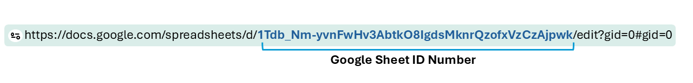

```{css bx-style, echo=FALSE}
/* Sidebar is a progress display, not navigation.                   */
/* allow_skip: false gates the Continue button but NOT the sidebar, */
/* so without this a student can click any topic and land there     */
/* having completed nothing.                                        */
/* Disabling the <li>, not the <a>: the <nav> is a shiny-bound-input */
/* that delegates clicks, so an inert <a> just passes the click up.  */
.topicsList .nav-pills .topic { pointer-events: none; }
/* learnr paints a topicProgress.png sprite as the <li> background. */
/* With the sidebar inert it reads as clutter.                     */
.topicsList .nav-pills .topic { background-image: none; }
.topicsList .nav-pills .topic:not(.current) > .nav-link { opacity: 0.5; }

/* Start Over sits in .topicsFooter, outside .nav-pills, so it stays */
/* clickable. The Previous button is deliberately NOT hidden --      */
/* with the sidebar inert it is the only way back to review.         */
```


```{r setup, include=FALSE}
library(learnr)
library(shiny)
library(gradethis)
library(httr)
library(ggplot2)

gradethis_setup()

tutorial_options(
  exercise.checker = gradethis::grade_learnr,
  exercise.completion = TRUE
)

`%||%` <- function(a, b) if (!is.null(a) && length(a) > 0) a else b

# Resolve the student ID no matter which session scope a handler receives.
# VERIFIED 2026-07-25 (learnr 0.11.6): question() blocks are Shiny MODULES, so
# a question_submission handler gets a NAMESPACED session whose input$sid is
# EMPTY. The ID lives on the root session. This fails silently -- rows land in
# the sheet looking well-formed but unattributable, grade_module() drops them,
# and the student loses that score with no warning anywhere. Do not "simplify"
# this back to session$input$sid.
bx_get_sid <- function(session) {
  usable <- function(x) !is.null(x) && length(x) > 0 && nzchar(as.character(x)[1])
  sid <- tryCatch(session$rootScope()$input$sid, error = function(e) NULL)
  if (usable(sid)) return(sid)
  sid <- tryCatch(session$userData$bx_sid, error = function(e) NULL)
  if (usable(sid)) return(sid)
  sid <- tryCatch(session$input$sid, error = function(e) NULL)
  if (usable(sid)) return(sid)
  NULL   # log_attempt()'s %||% turns this into "unknown"
}

# Is this the GRADED deployment or a practice copy?
# Set BISONEXPLORR_GRADED=true in the deployed app's .Renviron (or set the
# option in its startup). Practice copies launched with run_tutorial() never
# see it, so they default to FALSE.
#
# WHY THE PRACTICE BRANCH SHOWS A VISIBLE BANNER RATHER THAN NOTHING: if this
# flag is ever missing on a deployed graded app, the ID box disappears and
# nothing logs -- every student silently scores zero. A banner makes a
# misconfigured deploy announce itself on the first screen instead of three
# weeks later in the response sheet.
bx_is_graded <- function() {
  isTRUE(getOption(
    "BisonExplorR.graded",
    identical(tolower(Sys.getenv("BISONEXPLORR_GRADED")), "true")
  ))
}

log_attempt <- function(student_id, exercise_id, correct) {
  # Practice copies do not log. Without this, practice attempts POST with
  # student_id = "unknown" and fill the response sheet with orphan rows
  # that look like a bug in grade_module().
  if (!bx_is_graded()) return(invisible(NULL))

  tryCatch({
    httr::POST(
      url = "https://docs.google.com/forms/d/e/1FAIpQLSfmm3cUcoaWWYBb0zk7rbowSpgUL13nQc-Dxn7K8zQ30GdykA/formResponse",
      body = list(
        "entry.1413675438" = as.character(Sys.time()),
        "entry.1257984687" = as.character(student_id %||% "unknown"),
        "entry.1315894547" = "module3",   # tutorial_id — update to match your final numbering for the refresher
        "entry.1172625272" = as.character(exercise_id %||% "unknown"),
        "entry.1835356043" = as.character(correct %||% "NA")
      ),
      encode = "form"
    )
  }, error = function(e) message("Logging failed: ", e$message))
}

# Practice CSV path from the package
soil_file <- system.file("extdata", "soil_data.csv", package = "BisonExplorR")

# Pre-load the soil data so every exercise can use `soil`
soil <- read.csv(soil_file)
```

```{r event-setup, context="server-start"}
event_register_handler("exercise_result", function(session, event, data) {
  log_attempt(
    student_id  = bx_get_sid(session),
    exercise_id = data$label,
    correct     = data$feedback$correct
  )
})
```

## Welcome back!

```{r student-id, echo=FALSE}
uiOutput("sid_ui")
```

```{r sid-server, context="server"}
# The ID box exists ONLY in the graded deployment. See bx_is_graded() in setup.
output$sid_ui <- renderUI({
  if (!bx_is_graded()) {
    return(shiny::div(
      style = paste("padding:12px 14px; margin:6px 0;",
                    "border-left:4px solid #C05621; background:#FDF6EC;"),
      shiny::strong("Practice mode."),
      " Nothing here is recorded and this copy does not count for credit.",
      " To do this module for credit, run ",
      shiny::tags$code('launch_graded_tutorial("module3")'),
      " instead."
    ))
  }
  shiny::tagList(
    shiny::div(
      style = paste("padding:12px 14px; margin:6px 0;",
                    "border-left:4px solid #1F3864; background:#F2F4F7;"),
      shiny::strong("Graded copy."),
      " Your work on this module is recorded, so enter your student ID before",
      " you begin. Use the same ID every time \u2014 a different ID reads as a",
      " different student and your work will not be combined."
    ),
    shiny::textInput("sid",
      "Student ID (the same one you used in Module 1):", value = ""),
    shiny::div(id = "sid_warn",
      style = "color:#C05621; font-weight:600; margin:-6px 0 8px 0;",
      "Enter your ID to continue."),
    # Client-side gate on the section's Continue button. This prevents the
    # ACCIDENTAL case (a student who forgets), not a determined one -- anyone
    # with devtools can re-enable the button. The real protection against
    # unattributed rows is that grade_module() drops blank IDs.
    shiny::tags$script(shiny::HTML("
      (function () {
        function apply() {
          var sid = document.getElementById('sid');
          if (!sid) return;
          var sec = sid.closest('.section');
          if (!sec) return;
          var btns = sec.querySelectorAll('.topicActions button, .continueButton');
          var ok = sid.value.trim().length > 0;
          btns.forEach(function (b) {
            b.disabled = !ok;
            b.style.opacity = ok ? '' : '0.45';
            b.style.cursor  = ok ? '' : 'not-allowed';
          });
          var w = document.getElementById('sid_warn');
          if (w) w.style.display = ok ? 'none' : 'block';
        }
        document.addEventListener('input', function (e) {
          if (e.target && e.target.id === 'sid') apply();
        });
        // learnr renders sections progressively, so the Continue button may not
        // exist yet when this script first runs.
        new MutationObserver(apply)
          .observe(document.body, { childList: true, subtree: true });
        apply();
      })();
    "))
  )
})

# Cache the ID on userData as a second, independent path to it. bx_get_sid()
# checks rootScope() first and falls back to this.
shiny::observeEvent(input$sid, {
  if (!is.null(input$sid) && nzchar(input$sid)) {
    session$userData$bx_sid <- input$sid
  }
}, ignoreInit = TRUE)
```

exercises you complete.

It's been a few weeks, and that's plenty of time to forget where the
parentheses go. **That's completely normal, and this tutorial is here to
help.** There is *nothing new* in this module - it's a quick lap through
everything you did in the fall, so it all feels familiar again before we
take the next step.

We'll use the same soil dataset from last semester: 15 sites across
forest, agricultural, and urban land, with measurements like soil
temperature, organic matter, and respiration rate. Take your time, and
don't worry if something feels fuzzy at first - that's exactly what
we're here to fix.

By the end you will have refreshed how to:

- Store values in objects with `<-`
- Import a CSV with `read.csv()`
- Inspect a dataframe with `head()`, `str()`, and `summary()`
- Pull out a single column with `$`
- Build a scatter plot with `ggplot2`

## Remember from 203?

Before we touch R, a 30-second reminder of what "analysis-ready" data
looks like — the habits you built last semester are what make everything
below go smoothly.

- One row per observation, one column per variable
- Short lowercase names, no spaces (`soil_temp_c`, not `Soil Temp (C)`)
- Units in the header, not the cells
- Blank cells for missing data - no dashes, no "N/A"
- No merged cells, no color-coding for meaning

If any of that is fuzzy, this is the moment to ask - everything from
here on assumes data arrives already in this shape.

------------------------------------------------------------------------

## First, get back into Posit Cloud

Before the exercises below, take a moment to get your workspace back:

1.  Go to Posit Cloud and log in
2.  Open the RStudio Project you made for this course last semester
3.  If you like, open a new script (**File → New File → R Script**) to
    try things out alongside this tutorial

The code boxes in this tutorial run on their own, so you can work
through them right here — but having your own project open is a good
habit to get back into.

------------------------------------------------------------------------

## Refresher 1 - Objects and `<-`

Remember the assignment arrow? `<-` stores a value in an object so you
can use it again later.

### Your turn

Create an object called `n_sites` and give it the value `15`. Then type
`n_sites` on the next line to print it.

```{r review-assign, exercise=TRUE}
# Store 15 in an object called n_sites, then print it.
```

```{r review-assign-check}
grade_this({
  if (grepl("n_sites\\s*<-\\s*15", .user_code) &&
      grepl("\\bn_sites\\b", .user_code)) {
    pass("It comes back quickly — `<-` stores a value, and now n_sites holds 15.")
  }

  fail("Write:\n\nn_sites <- 15\nn_sites")
})
```

------------------------------------------------------------------------

## Refresher 2 - Import a CSV with `read.csv()`

In the fall you imported data by pointing `read.csv()` at a file. Here
the soil file is ready for you as `soil_file`.

### Your turn

The import line is written for you below. Add one more line —
`class(soil)` — to confirm R read it in as a **data frame**.

```{r review-import, exercise=TRUE}
# Add a line below: class(soil)
soil <- read.csv(soil_file)
```

```{r review-import-check}
grade_this({
  if (identical(.result, "data.frame")) {
    pass("Just like last semester — read.csv() gives you a data frame.")
  }
  fail("Add class(soil) on the next line to check what kind of object soil is.")
})
```

------------------------------------------------------------------------

## Refresher 3 - Take a look with `head()`

Once data is imported, the first thing to do is look at it. `head()`
shows the first six rows.

### Your turn

Preview the soil data with `head(soil)`.

```{r review-head, exercise=TRUE}
# Preview the first six rows of soil.
```

```{r review-head-check}
grade_this({
  if (isTRUE(all.equal(.result, head(soil), check.attributes = FALSE))) {
    pass("There's the data — six rows, all your columns.")
  }
  fail("Try head(soil).")
})
```

------------------------------------------------------------------------

## Refresher 4 - Check the structure with `str()`

`str()` reminds you what type each column is — numbers (`num`), text
(`chr`), and so on. This is how you catch a column that imported as the
wrong type.

### Your turn

Run `str(soil)`.

```{r review-str, exercise=TRUE}
# Inspect the structure of soil.
```

```{r review-str-check}
grade_this({
  # str() prints its output and returns nothing, so we check the submitted code.
  if (grepl("str\\s*\\(\\s*soil\\s*\\)", .user_code)) {
    pass("Good — land_use reads as chr (text), and the measurements read as num.")
  }
  fail("Try str(soil).")
})
```

------------------------------------------------------------------------

## Refresher 5 - Pull out a column with `$`

The `$` sign reaches into a data frame and grabs one column by name:
`dataframe$column`.

### Your turn

Pull out just the `organic_matter_pct` column from `soil`.

```{r review-dollar, exercise=TRUE}
# Grab the organic_matter_pct column from soil using $.
```

```{r review-dollar-check}
grade_this({
  if (isTRUE(all.equal(.result, soil$organic_matter_pct))) {
    pass("That's the column, on its own — soil$organic_matter_pct.")
  }
  fail("Use soil$organic_matter_pct to pull out that one column.")
})
```

------------------------------------------------------------------------

## Refresher 6 - Your first graph, again

You finished the fall by making a scatter plot. Let's rebuild it.
Remember the recipe: start with `ggplot(data, aes(...))`, then add a
geom with `+`.

### Your turn

Plot `organic_matter_pct` (x) against `respiration_rate_mg_co2_kg_hr`
(y), and add `geom_point()`.

```{r review-plot, exercise=TRUE}
# Add geom_point() to finish the scatter.
ggplot(soil, aes(x = organic_matter_pct, y = respiration_rate_mg_co2_kg_hr))
```

```{r review-plot-check}
grade_this({
  if (!inherits(.result, "ggplot")) {
    fail("Start from the ggplot() line and add a geom with +.")
  }
  geoms <- vapply(.result$layers, function(l) class(l$geom)[1], character(1))
  if ("GeomPoint" %in% geoms) {
    pass("And you're back — richer soils respire more, just like before break.")
  }
  fail("Add + geom_point() to draw the points.")
})
```

------------------------------------------------------------------------

## From Sheets to R

In 203 you built your data by hand in Sheets. From here on, instead of
downloading a CSV and uploading it every time, you'll pull the Sheet
straight into R — so it always reflects the latest version, with no
manual export step.

### Turning a Sheet link into a data link

Every Google Sheet URL contains a long ID between `/d/` and `/edit`:

{width="100%"}

Swap everything after that ID for `/export?format=csv` and you get a
link R can read directly:

```         
https://docs.google.com/spreadsheets/d/1AbCdEfGhIjKlMnOpQrStUvWxYz/export?format=csv
```

**Your turn.** The object `sheet_id` below holds a Sheet's ID. Build
`csv_url`, the export link, by pasting `sheet_id` into the export
pattern.

```{r q7, exercise=TRUE}
sheet_id <- "1Tdb_Nm-yvnFwHv3AbtkO8IgdsMknrQzofxVzCzAjpwk"

# Build the export link using sheet_id
csv_url <- paste0("https://docs.google.com/spreadsheets/d/", "sheet_id goes here", "/export?format=csv")
csv_url
```

```{r q7-check}
grade_this({
  sheet_id <- "1Tdb_Nm-yvnFwHv3AbtkO8IgdsMknrQzofxVzCzAjpwk"
  correct  <- paste0("https://docs.google.com/spreadsheets/d/", sheet_id, "/export?format=csv")
  if (isTRUE(.result == correct)) {
    pass("That link streams the live Sheet as a CSV -- no download, no upload, never out of date.")
  }
  fail('Not quite. Paste sheet_id into the export pattern: paste0("https://docs.google.com/spreadsheets/d/", sheet_id, "/export?format=csv").')
})
```

> Once your instructor shares the real class data Sheet, this is the
> exact pattern you'll use all semester: grab the ID, build the export
> link, `read_csv()` it. Bookmark this exercise.


### Reading the live Google Sheet

Now let's actually use the link you just built.

Add one more line to read the Google Sheet into an object called
`class_data`, then run `str(class_data)` to inspect it.

```{r q8, exercise=TRUE}
sheet_id <- "1Tdb_Nm-yvnFwHv3AbtkO8IgdsMknrQzofxVzCzAjpwk"

csv_url <- paste0(
  "https://docs.google.com/spreadsheets/d/",
  sheet_id,
  "/export?format=csv"
)

# Read the Google Sheet into an object called class_data

# Then inspect the structure

```

```{r q8-check}
grade_this({

  if (!exists("class_data", envir = .user_env)) {
    fail("Create an object called class_data using read.csv(csv_url).")
  }

  if (!is.data.frame(get("class_data", envir = .user_env))) {
    fail("class_data should be a data frame.")
  }

  if (!grepl("str\\s*\\(\\s*class_data\\s*\\)", .user_code)) {
    fail("After importing the data, run str(class_data).")
  }

  pass("Excellent! You successfully imported a live Google Sheet and inspected its structure. This is exactly how you'll bring class data into R throughout the semester.")
})
```

**Discussion (not graded):** Look through the output from `str(class_data)`.

- How many rows and columns are in the dataset?
- Which variables are numeric (`num`)?
- Which variables are character (`chr`)?
- Why is checking the structure one of the first things you should do after importing any dataset?

------------------------------------------------------------------------

## You're refreshed

Everything you just did — objects, importing, inspecting, columns, and a
ggplot — is the foundation you built in the fall, and it's all still
there.

Next up, **Module 4** takes these same skills further: instead of just
viewing and plotting a dataset, you'll learn to *reshape* it — filtering
rows, making new columns, summarizing by group, and joining tables
together. See you there.
